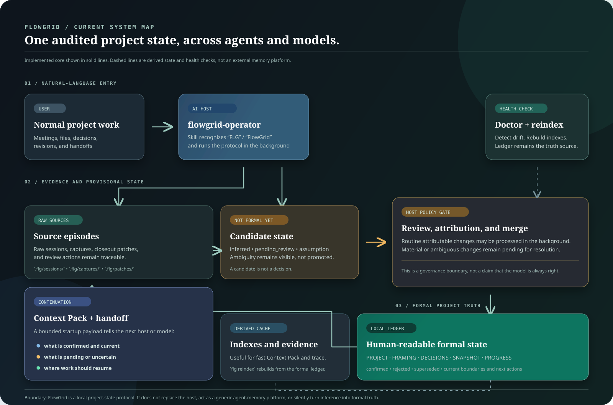

# FlowGrid (FLG)

[English](./README.md) | [简体中文](./README.zh-CN.md)

> A local project-state context engine for people who use multiple AI hosts and
> models on rationale-heavy, non-coding work.


[](https://github.com/dlxeva/FlowGrid/actions/workflows/ci.yml)

[](./LICENSE)

FlowGrid keeps the judgment behind a project available across sessions, models, and local AI hosts. It stores reviewed decisions, their evidence, pending changes, and bounded continuation context in project files.

The primary interface is natural language in an AI host. The CLI is the underlying protocol that the host operates and that people can inspect.

> **Current status:** the package reports `v0.3.0`. The repository is validating
> the v0.4 core. Current work focuses on reliable host entry, rebuildable state,
> source-backed work views, and real-project continuation. v0.4 is not presented
> as a released version.

## Start in an AI Host

Install the repository in editable mode, then install the included operator skill into supported local hosts:

```bash
pip install -e .
flg onboard --skip-demo --yes
```

Continue in your usual host with a request such as:

> Use FLG to manage and continue this project.

The host resolves the project, reads reviewed and pending state, runs the necessary `flg` commands, and reports material changes or review boundaries. The user should not have to maintain a ledger by hand.

`flg onboard` can also run a guided demo. Run the demo in a disposable directory because it creates a sample project. See
[First run in AI hosts](./docs/first-run-in-hosts.md) and
[Host usage](./docs/host-usage.md) for current integration boundaries.

## What FlowGrid Gives You

Long-running AI work accumulates more conversation than the next model should reload, while ordinary summaries often remove the reasons that make a project safe to continue.

FlowGrid keeps five things distinct:

- raw source material that can be inspected later;
- formal decisions with rationale, rejected alternatives, and reversal
  conditions;
- unreviewed candidates that must not become current truth by accident;
- the current action, blockers, constraints, and open questions;
- compact views that can be rebuilt for the next session or host.


A new host can start from bounded project state, expand evidence when needed, and see when a view is stale. FlowGrid does not route models, schedule an agent team, or replace the source documents that govern the work.

## Three-Layer Project State

FlowGrid uses three layers with different authority.

| Layer | Contents | Authority |
| --- | --- | --- |
| 1. Authoritative sources and formal ledger | Declared source documents plus reviewed `PROJECT.md`, `FRAMING.md`, `DECISIONS.md`, `SNAPSHOT.md`, and `PROGRESS.md` | Current project truth, subject to each source's declared scope |
| 2. Pending changes | `status: pending_review` patches and captures with provenance | Candidate state only; the host must not present it as confirmed |
| 3. Rebuildable views | Context Packs, Continuity Manifest, Source-backed Work View, evidence index, and handoff output | Derived navigation and startup material; rebuild from Layers 1 and 2 |

This replaces the older Two-Layer State description. The third layer matters because a generated context file can become stale even when its source remains authoritative.

The formal ledger remains human-readable Markdown. Derived indexes and context files are disposable. If they disagree, inspect the source and formal ledger, then rebuild the view.

## Source-backed Work View

Some projects already have a detailed work ledger, brief, or operating document that names the current action. Copying that document into another status system creates drift.

The Source-backed Work View gives an AI host a bounded projection over a declared project-relative source. It extracts the current action, blockers, and necessary constraints while keeping the source location visible.

User value:

- continue from the live work source without loading the whole document;
- keep operational context separate from formal decision approval;
- detect when the exact source block has changed;
- stop stale current-action text from silently driving the next session.

### Declare the source

Add an optional `work_source` extension to `.flg/state.json`:

```json
{
  "work_source": {
    "schema_version": "1",
    "path": "docs/work-ledger.md",
    "start_marker": "<!-- current-work:start -->",
    "end_marker": "<!-- current-work:end -->"
  }
}
```

The path must be relative to the project. Symlinked sources and paths that
escape the project are rejected. The file must be UTF-8 text. Markers are
optional, but when used they must both appear exactly once and in order.

A generic marked block can look like this:

```markdown
<!-- current-work:start -->
## Current Action

- Compare the two approved outline options.

## Blockers

- Waiting for one sample export.

## Necessary Constraints

- Treat draft copy as unapproved.
<!-- current-work:end -->
```

Build the view:

```bash
flg context --mode work
```

The command writes `.flg/context/work-view.md` and a manifest containing the source locator and block SHA-256.

### Block SHA expiry protection

FlowGrid hashes the declared block, not the entire source file. Editing outside the marked block does not expire the view. Changing the block, source path, or markers makes the view stale.

When stale:

- `flg doctor --strict` reports the stale Source-backed Work View;
- the Continuity Manifest marks the current action as `needs_recheck`;
- stale action text is withheld from the manifest's current-action field;
- a person or host must inspect the changed source before rebuilding with
  `flg context --mode work`.

The SHA check detects change. It does not judge whether the new text is correct, approved, or a formal decision. Decision candidates still use the normal review and merge gates.

## Decision Logs

FlowGrid began as a Markdown decision-log mechanism. That remains the center of the project.

`DECISIONS.md` records what was decided, why it was chosen, what was rejected, and what would justify revisiting it. A decision entry uses these fields:

| Field | Purpose |
| --- | --- |
| `id` | Stable decision identifier |
| `date` | Decision date |
| `context` | Situation that required a judgment |
| `decision` | Reviewed choice |
| `rationale` | Reason for the choice |
| `alternatives_rejected` | Options considered and rejected |
| `reversal_conditions` | Evidence or events that should reopen the choice |
| `impact` | Expected consequences |
| `status` | Active, superseded, or revisited state |

Raw sessions remain available for evidence. The evidence index supports traceability, but it is a rebuildable cache. An extracted sentence or an agent-authored suggestion is not a decision until the review path establishes its authority and provenance.

## Core Workflow

### 1. Initialize a project

```bash
mkdir example-project
cd example-project
flg init 'Example Project' --type proposal --client 'Example Client'
```

For an English-first formal ledger:

```bash
flg init 'Example Project' --language en
```

Initialization creates the formal Markdown ledger and `.flg/` protocol state.

### 2. Frame the work

```bash
flg frame
```

`flg frame` checks framing completeness and creates a patch with missing questions. It also reports a missing, secondary, or speculative evidence basis.

### 3. Capture a work segment

Use raw notes or a transcript with speaker attribution:

```bash
flg closeout --transcript session-notes.md
```

An external transcript is copied into `.flg/sessions/` before extraction.
Do not pass `PROGRESS.md`, `SNAPSHOT.md`, `DECISIONS.md`, or another
structured ledger file as ordinary closeout input.

A short, explicitly attributed judgment can enter through `flg capture add`.
A meeting or multi-signal explanation should use `flg closeout`.

### 4. Review before adoption

```bash
flg review --patch .flg/patches/<patch-file>.md --report-only
flg review --patch .flg/patches/<patch-file>.md --autonomous
flg merge --patch .flg/patches/<patch-file>.md --yes
```

`--report-only` performs a non-writing quality gate. Autonomous review adopts
only clear candidates with explicit user or client attribution. Agent-authored,
unattributed, shell, and ambiguous candidates stay pending.

Merge applies accepted decisions and routine progress while preserving the
patch and source trail. A stale patch can be closed with `flg patch supersede`
or `flg patch discard`.

### 5. Continue from bounded context

```bash
flg status
flg context --mode resume --budget 4000
```

The full Context Pack includes reviewed decisions, pending material, current
state, and source health within a budget. Raw sessions are not loaded by
default.

For a compact navigation view:

```bash
flg context --mode manifest
```

The Continuity Manifest points back to source sections and evidence expansion
commands. It is a generated view, not a replacement authority.

## Project Layout

```text
example-project/
├── PROJECT.md
├── FRAMING.md
├── DECISIONS.md
├── SNAPSHOT.md
├── PROGRESS.md
├── GOAL_EVOLUTION.md
├── CONSTRAINTS.md
└── .flg/
    ├── CONTRACT.md
    ├── state.json
    ├── index.json
    ├── patches/
    ├── captures/
    ├── sessions/
    └── context/
```

Not every optional directory appears in every project. The formal ledger is
plain Markdown. `.flg/state.json` carries protocol state and extensions.
Generated views and indexes can be rebuilt.

## CLI Reference

The host normally calls these commands. They remain available for inspection,
automation, and debugging.

| Command | Purpose |
| --- | --- |
| `flg onboard [--skip-demo] [--yes]` | Check the environment and install the operator skill |
| `flg init <name> [--language en|zh]` | Initialize a project |
| `flg frame` | Check framing and create a frame patch |
| `flg closeout --transcript <file>` | Archive and extract a work segment into a patch |
| `flg session save <file>` | Archive a raw session with a stable source path |
| `flg capture add` | Record a real-time judgment candidate |
| `flg capture review` | Process confirmed captures and retain inferred ones |
| `flg review --patch <file> --report-only` | Inspect candidates without writing the ledger |
| `flg review --patch <file> --autonomous` | Adopt eligible attributed candidates |
| `flg merge --patch <file> --yes` | Merge accepted and routine patch content |
| `flg patch supersede <id> --reason <text>` | Retire a patch replaced by newer work |
| `flg patch discard <id> --reason <text>` | Close a rejected or non-adoptable patch |
| `flg status` | Show pending and closed project state |
| `flg context --mode resume` | Build the full startup Context Pack |
| `flg context --mode manifest` | Build the compact Continuity Manifest |
| `flg context --mode work` | Build the Source-backed Work View |
| `flg evidence <decision-id>` | Show evidence for a reviewed decision |
| `flg trace <decision-id>` | Trace a judgment through source episodes |
| `flg handoff` | Generate a handoff summary |
| `flg export-handoff` | Export a resumable handoff pack |
| `flg doctor [--strict]` | Check ledger, index, source, and view consistency |
| `flg reindex` | Rebuild the evidence index from `DECISIONS.md` |
| `flg audit <path>` | Audit an existing project without initializing it |
| `flg import <source>` | Import an existing project into FlowGrid |
| `flg wiki status` | Check an optional wiki index without writing |

Run `flg <command> --help` for current options.

## Fit and Boundaries

FlowGrid is designed for a single project owner or small team carrying
rationale-heavy work across AI sessions and hosts. Typical work includes
proposals, campaigns, operating mechanisms, research briefs, strategy, and
retrospectives.

It is less useful when:

- the task ends in one conversation;
- a sprint tracker or code-agent orchestrator already holds the required state;
- the user wants automatic decisions without a review boundary;
- the governing source cannot be stored or referenced locally.

FlowGrid is local-first, not local-only by guarantee. Some optional closeout
paths can call a remote model. Raw transcripts must not be sent to a remote
provider without explicit authorization for that provider and purpose.

The project does not claim that every host integration is complete, that
generated context is always correct, or that a benchmark result proves product
adoption. Files, source health, tests, and review status remain separate forms
of evidence.

## Validation Scope

The repository is in v0.4 core validation. Current validation focuses on:

- natural-language host entry and command resolution;
- separation of formal, pending, and derived state;
- source-backed current-work freshness;
- evidence and index rebuildability;
- continuation across longer, contradictory project histories.

Repository tests and smoke checks verify implemented contracts. They do not by
themselves establish real-world usefulness, cross-host reliability, or human
acceptance.

Run local checks after installation:

```bash
python -m pytest -q
python scripts/smoke_test.py
flg doctor --strict
```

Use `flg doctor --strict` inside an initialized project. A failing strict check
means the project state needs attention; it is not an automatic repair command.

## Public Benchmark Result

[](https://agentmemories.ai/leaderboard/academic/textual)

The independent
[FlowGrid AML Retriever](https://github.com/dlxeva/flowgrid-aml-retriever)
ranked **#8** in the first public Agent Memory Leaderboard Academic Textual
track, with an overall score of **43.98**, **1.08 points behind the top-ranked
entry**. See the
[public leaderboard](https://agentmemories.ai/leaderboard/academic/textual).

AML Retriever and FlowGrid Core share ideas about provenance, temporal state,
conflict preservation, and traceable retrieval. They are separate systems.
AML Retriever implements the benchmark's deterministic Add/Search contract.
The result does not establish FlowGrid Core product quality, user adoption,
retention, or general superiority.

## Related Experiments

These branches test selected ideas under narrower contracts. They are not
FlowGrid Core dependencies or evidence of Core maturity.

- [FlowGrid AML Retriever summary](https://github.com/dlxeva/flowgrid-aml-retriever)
- [FlowGrid Memory Runtime summary](https://github.com/dlxeva/flowgrid-memory-runtime)
- [FlowGrid MemoryAgent for Qwen Cloud summary](https://github.com/dlxeva/flowgrid-qwen-memory-agent)

## Documentation

- [Protocol](./docs/protocol.md)
- [Context Pack contract](./docs/product/context-pack-contract.md)
- [Judgment capture pipeline](./docs/product/judgment-capture-pipeline.md)
- [Decision relations](./docs/product/decision-relations-v0.md)
- [User pain model](./docs/product/user-pain-model.md)
- [Synthetic client-solution use case](./docs/use-cases/client-solution-continuation.md)
- [Development log](./docs/devlog/README.md)
- [Security policy](./SECURITY.md)
- [Contributing](./CONTRIBUTING.md)

The system map distinguishes formal state from derived views and health checks:



## Governance and License

FlowGrid Core is released under the [MIT License](./LICENSE).
See [TRADEMARK.md](./TRADEMARK.md) for name and logo usage.

Security reports should follow [SECURITY.md](./SECURITY.md).
