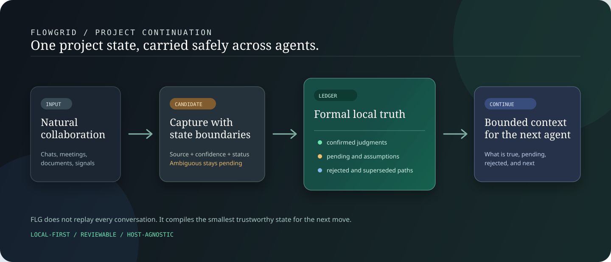
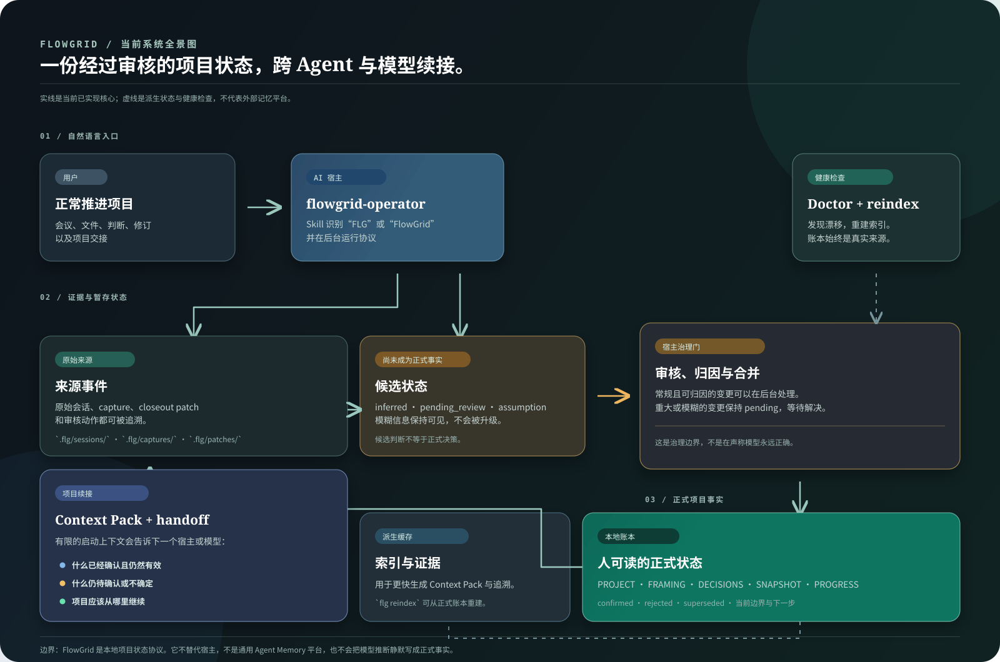

# FlowGrid（FLG）

[English](./README.md) | [简体中文](./README.zh-CN.md)

> 面向多 AI 宿主、多模型推导密集型非代码工作的本地项目状态上下文引擎。


[](https://github.com/dlxeva/FlowGrid/actions/workflows/ci.yml)

[](./LICENSE)

FlowGrid 让项目判断跨会话、跨模型、跨本地 AI 宿主延续。它把已审核决策、
决策证据、待审核变化和有边界的续接上下文保存在项目文件中。

主要入口是 AI 宿主里的自然语言。CLI 是宿主在后台调用、用户可以检查的底层协议。

> **当前状态：** 软件包版本为 `v0.3.0`，仓库正在验证 v0.4 Core。
> 当前重点是宿主入口可靠性、可重建状态、来源支撑的工作视图和真实项目续接。
> v0.4 尚未作为已发布版本呈现。

## 在 AI 宿主里开始

以 editable 模式安装仓库，再把内置 operator skill 安装到支持的本地宿主：

```bash
pip install -e .
flg onboard --skip-demo --yes
```

回到常用宿主，用类似下面的自然语言继续：

> 用 FLG 管理并继续这个项目。

宿主会定位项目，读取已审核状态和待审核状态，执行必要的 `flg` 命令，
只汇报实质变化或审核边界。用户无需手工维护账本。

`flg onboard` 也能运行引导 demo。demo 会创建样例项目，请在一次性目录中运行。
当前集成边界见
[AI 宿主首次使用](./docs/first-run-in-hosts.md)和
[宿主使用说明](./docs/host-usage.md)。

## FlowGrid 提供什么

长期 AI 协作会积累大量对话。下一个模型不适合重新加载全部历史。
普通摘要又常常删掉保证项目安全续接所需的理由。

FlowGrid 把五类内容分开保存：

- 以后可以回查的原始来源材料；
- 带理由、放弃方案和反转条件的正式决策；
- 不得自动变成当前事实的待审核候选；
- 当前行动、阻塞、约束和开放问题；
- 为下一次会话或宿主重建的紧凑视图。



新宿主可以从有边界的项目状态开始，按需展开证据，并识别已经过期的视图。
FlowGrid 不负责模型路由，不调度 Agent 团队，也不替代治理项目的原始文档。

## 三层项目状态

FlowGrid 使用权威等级不同的三层状态。

| 层级 | 内容 | 权威边界 |
| --- | --- | --- |
| 1. 权威来源与正式账本 | 已声明的来源文档，以及审核后的 `PROJECT.md`、`FRAMING.md`、`DECISIONS.md`、`SNAPSHOT.md`、`PROGRESS.md` | 当前项目事实，具体范围由各来源声明决定 |
| 2. 待审核变化 | 带来源的 `status: pending_review` patch 和 capture | 仅为候选状态，宿主不得当作已确认事实 |
| 3. 可重建视图 | Context Pack、Continuity Manifest、Source-backed Work View、证据索引和 handoff 输出 | 用于导航和启动的派生内容，从第一层和第二层重建 |

这套模型替代旧版 Two-Layer State。第三层单独存在，因为生成后的上下文文件可能过期，
其来源仍然可以保持权威。

正式账本是人能直接阅读的 Markdown。派生索引和上下文文件可以丢弃。
两者发生冲突时，先检查来源和正式账本，再重建视图。

## Source-backed Work View

有些项目已经用一份详细的工作账本、brief 或执行文档记录当前行动。
把它复制进另一套状态系统会产生漂移。

Source-backed Work View 在已声明的项目内来源上生成有边界的投影视图。
它提取当前行动、阻塞项和必要约束，同时保留来源定位。

用户得到的价值：

- 从正在使用的工作来源续接，无需加载整份文档；
- 运行上下文和正式决策审批保持分离；
- 精确识别已声明来源区块是否变化；
- 阻止过期的当前行动在下次会话中继续生效。

### 声明来源

在 `.flg/state.json` 中增加可选的 `work_source` 扩展字段：

```json
{
  "work_source": {
    "schema_version": "1",
    "path": "docs/work-ledger.md",
    "start_marker": "<!-- current-work:start -->",
    "end_marker": "<!-- current-work:end -->"
  }
}
```

路径必须相对于项目目录。指向项目外的路径和符号链接会被拒绝。
文件必须是 UTF-8 文本。marker 可以省略；使用时必须成对提供，各出现一次，
并保持起止顺序。

一个通用的标记区块可以写成：

```markdown
<!-- current-work:start -->
## Current Action

- Compare the two approved outline options.

## Blockers

- Waiting for one sample export.

## Necessary Constraints

- Treat draft copy as unapproved.
<!-- current-work:end -->
```

生成视图：

```bash
flg context --mode work
```

命令会写入 `.flg/context/work-view.md`，并生成包含来源定位和区块 SHA-256
的 manifest。

### 区块 SHA 过期保护

FlowGrid 计算已声明区块的哈希值，不计算整份来源文件。修改 marker 之外的内容
不会让视图过期。修改区块、来源路径或 marker 配置会把视图标记为 stale。

视图过期后：

- `flg doctor --strict` 会报告 Source-backed Work View 已过期；
- Continuity Manifest 把当前行动标为 `needs_recheck`；
- manifest 的当前行动字段不会继续暴露过期行动文本；
- 人或宿主必须先检查已变化的来源，再运行
  `flg context --mode work` 重建。

SHA 检查只能发现变化。它不能判断新文本是否正确、是否获批或是否属于正式决策。
决策候选仍要经过常规 review 和 merge gate。

## 决策日志

FlowGrid 起源于 Markdown 决策日志机制。这套机制至今仍是项目中心。

`DECISIONS.md` 记录做了什么决定、为何选择、放弃了什么，以及什么条件会触发重审。
每条决策使用以下字段：

| 字段 | 用途 |
| --- | --- |
| `id` | 稳定的决策标识 |
| `date` | 决策日期 |
| `context` | 需要做出判断的情境 |
| `decision` | 审核后的选择 |
| `rationale` | 选择理由 |
| `alternatives_rejected` | 考虑后放弃的方案 |
| `reversal_conditions` | 应重新打开决策的证据或事件 |
| `impact` | 预期影响 |
| `status` | active、superseded 或 revisited 状态 |

原始会话作为证据保留。证据索引用于追溯，但它属于可重建缓存。
抽取出的句子和 Agent 提议都不是正式决策。review 流程需要确认其权威和来源。

## 核心流程

### 1. 初始化项目

```bash
mkdir example-project
cd example-project
flg init 'Example Project' --type proposal --client 'Example Client'
```

正式账本以英文为主时：

```bash
flg init 'Example Project' --language en
```

初始化会创建正式 Markdown 账本和 `.flg/` 协议状态。

### 2. 校准 framing

```bash
flg frame
```

`flg frame` 检查 framing 是否完整，并为缺失问题生成 patch。
它也会报告缺少证据依据、仅有二手依据或依赖推测的情况。

### 3. 捕获一段工作

使用带说话人归属的原始笔记或转写：

```bash
flg closeout --transcript session-notes.md
```

外部 transcript 会在抽取前复制到 `.flg/sessions/`。
不要把 `PROGRESS.md`、`SNAPSHOT.md`、`DECISIONS.md`
或其他结构化账本文件当作普通 closeout 输入。

一句有明确归属的短判断可以走 `flg capture add`。
会议或包含多条信号的解释应走 `flg closeout`。

### 4. 审核后再吸收

```bash
flg review --patch .flg/patches/<patch-file>.md --report-only
flg review --patch .flg/patches/<patch-file>.md --autonomous
flg merge --patch .flg/patches/<patch-file>.md --yes
```

`--report-only` 执行不写账本的质量检查。autonomous review 只吸收
来源明确的用户或客户候选。Agent 自己提出、缺少归属、空壳或含糊的候选保持 pending。

merge 写入已接受决策和常规进展，并保留 patch 与来源链。
过期 patch 可用 `flg patch supersede` 或 `flg patch discard` 关闭。

### 5. 从有边界的上下文继续

```bash
flg status
flg context --mode resume --budget 4000
```

完整 Context Pack 在预算内包含已审核决策、待处理材料、当前状态和来源健康信息。
默认不会加载原始会话。

需要紧凑导航视图时：

```bash
flg context --mode manifest
```

Continuity Manifest 指向来源区段和证据展开命令。它是生成视图，不替代权威来源。

## 项目结构

```text
example-project/
├── PROJECT.md
├── FRAMING.md
├── DECISIONS.md
├── SNAPSHOT.md
├── PROGRESS.md
├── GOAL_EVOLUTION.md
├── CONSTRAINTS.md
└── .flg/
    ├── CONTRACT.md
    ├── state.json
    ├── index.json
    ├── patches/
    ├── captures/
    ├── sessions/
    └── context/
```

并非每个项目都会出现全部可选目录。正式账本使用纯 Markdown。
`.flg/state.json` 保存协议状态和扩展字段。生成视图与索引都可重建。

## CLI 参考

宿主通常在后台调用这些命令。用户仍可用它们检查、自动化和排错。

| 命令 | 用途 |
| --- | --- |
| `flg onboard [--skip-demo] [--yes]` | 检查环境并安装 operator skill |
| `flg init <name> [--language en|zh]` | 初始化项目 |
| `flg frame` | 检查 framing 并生成 frame patch |
| `flg closeout --transcript <file>` | 归档工作段并抽取为 patch |
| `flg session save <file>` | 用稳定来源路径归档原始会话 |
| `flg capture add` | 记录实时判断候选 |
| `flg capture review` | 处理 confirmed capture，保留 inferred capture |
| `flg review --patch <file> --report-only` | 检查候选，不写正式账本 |
| `flg review --patch <file> --autonomous` | 吸收符合条件且归属明确的候选 |
| `flg merge --patch <file> --yes` | 合并已接受内容和常规 patch 内容 |
| `flg patch supersede <id> --reason <text>` | 关闭已被新工作替代的 patch |
| `flg patch discard <id> --reason <text>` | 关闭已拒绝或不可吸收的 patch |
| `flg status` | 查看待审核和已关闭状态 |
| `flg context --mode resume` | 生成完整启动 Context Pack |
| `flg context --mode manifest` | 生成紧凑 Continuity Manifest |
| `flg context --mode work` | 生成 Source-backed Work View |
| `flg evidence <decision-id>` | 查看已审核决策的证据 |
| `flg trace <decision-id>` | 沿来源 episode 追溯判断 |
| `flg handoff` | 生成 handoff 摘要 |
| `flg export-handoff` | 导出可续接 handoff pack |
| `flg doctor [--strict]` | 检查账本、索引、来源和视图一致性 |
| `flg reindex` | 从 `DECISIONS.md` 重建证据索引 |
| `flg audit <path>` | 审计已有项目，不执行初始化 |
| `flg import <source>` | 把已有项目导入 FlowGrid |
| `flg wiki status` | 只读检查可选 Wiki 索引 |

运行 `flg <command> --help` 查看当前选项。

## 适用范围与边界

FlowGrid 面向单个项目 owner 或小团队。他们需要让推导密集型工作跨 AI 会话和宿主延续。
典型工作包括方案、campaign、运营机制、研究 brief、策略和复盘。

以下情况不太适合：

- 任务在一次对话内结束；
- sprint tracker 或代码 Agent 编排器已经保存所需状态；
- 用户希望系统绕过审核边界自动做决定；
- 治理项目的来源无法在本地保存或引用。

FlowGrid 采用 local-first 设计，但不承诺所有路径都只在本地执行。
部分可选 closeout 路径能够调用远程模型。未经用户对具体服务商和用途的明确授权，
不得向远程提供商发送原始 transcript。

项目不宣称所有宿主集成都已完成，不宣称生成上下文永远正确，也不把榜单成绩
当作产品采用证明。文件、来源健康、测试和审核状态属于不同证据层。

## 验证范围

仓库正在进行 v0.4 Core 验证，当前关注：

- 自然语言宿主入口和命令解析；
- 正式、待审核和派生状态的分离；
- 来源支撑的当前工作视图是否新鲜；
- 证据与索引是否可重建；
- 更长、含矛盾项目历史的续接。

仓库测试和 smoke check 验证已经实现的契约。它们不能单独证明真实用户价值、
跨宿主可靠性或真人验收。

安装后可运行本地检查：

```bash
python -m pytest -q
python scripts/smoke_test.py
flg doctor --strict
```

请在已初始化项目中运行 `flg doctor --strict`。strict 检查失败表示项目状态需要处理，
该命令不会自动修复。

## 公开评测成绩

[](https://agentmemories.ai/leaderboard/academic/textual)

独立项目
[FlowGrid AML Retriever](https://github.com/dlxeva/flowgrid-aml-retriever)
在首期公开 Agent Memory Leaderboard Academic Textual 赛道位列
**第 8 名**，综合分 **43.98**，与榜首相差 **1.08 分**。
结果见[公开榜单](https://agentmemories.ai/leaderboard/academic/textual)。

AML Retriever 与 FlowGrid Core 共享来源、时间状态、冲突保留和可追溯检索等思路。
它们是两个独立系统。AML Retriever 实现榜单要求的确定性 Add/Search 契约。
这项成绩不能证明 FlowGrid Core 的产品质量、用户采用、留存或普遍优越性。

## 相关实验

这些支线在更窄的契约中测试部分思路。它们不是 FlowGrid Core 的依赖，
也不能证明 Core 已经成熟。

- [FlowGrid AML Retriever 摘要](https://github.com/dlxeva/flowgrid-aml-retriever)
- [FlowGrid Memory Runtime 摘要](https://github.com/dlxeva/flowgrid-memory-runtime)
- [FlowGrid MemoryAgent for Qwen Cloud 摘要](https://github.com/dlxeva/flowgrid-qwen-memory-agent)

## 文档

- [协议说明](./docs/protocol.md)
- [Context Pack 契约](./docs/product/context-pack-contract.md)
- [判断捕获流程](./docs/product/judgment-capture-pipeline.md)
- [决策关系](./docs/product/decision-relations-v0.md)
- [用户痛点模型](./docs/product/user-pain-model.md)
- [虚构客户方案续接案例](./docs/use-cases/client-solution-continuation.md)
- [开发日志](./docs/devlog/README.md)
- [安全策略](./SECURITY.md)
- [贡献指南](./CONTRIBUTING.md)

系统图将正式状态、派生视图和健康检查分开：



## 治理与许可证

FlowGrid Core 使用 [MIT License](./LICENSE)。
名称和 logo 的使用规则见 [TRADEMARK.md](./TRADEMARK.md)。

安全问题请按 [SECURITY.md](./SECURITY.md) 提交。
